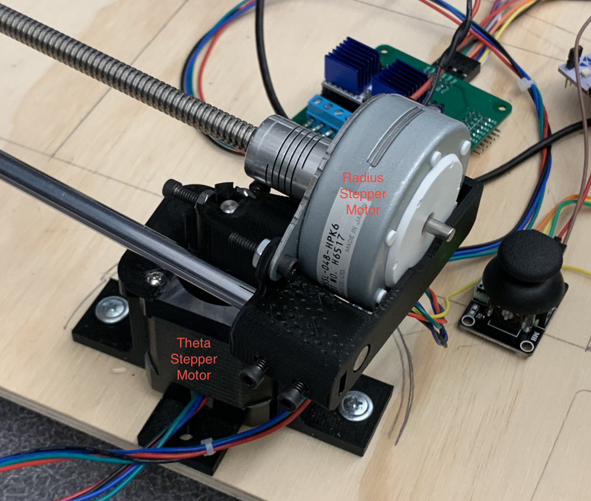
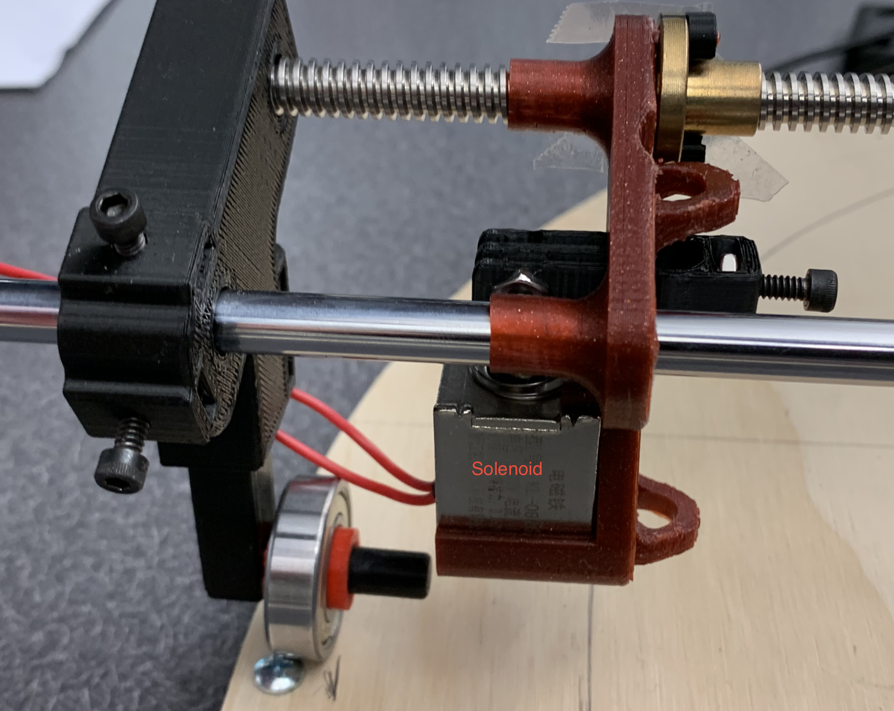
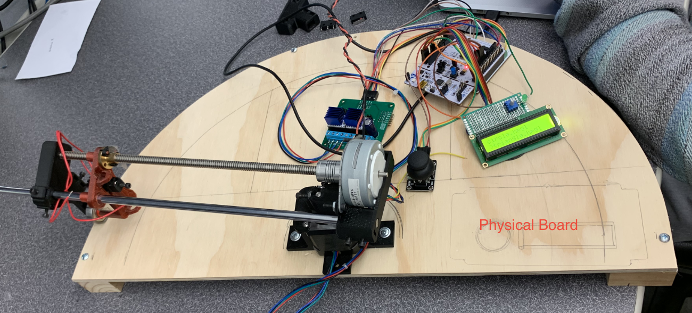
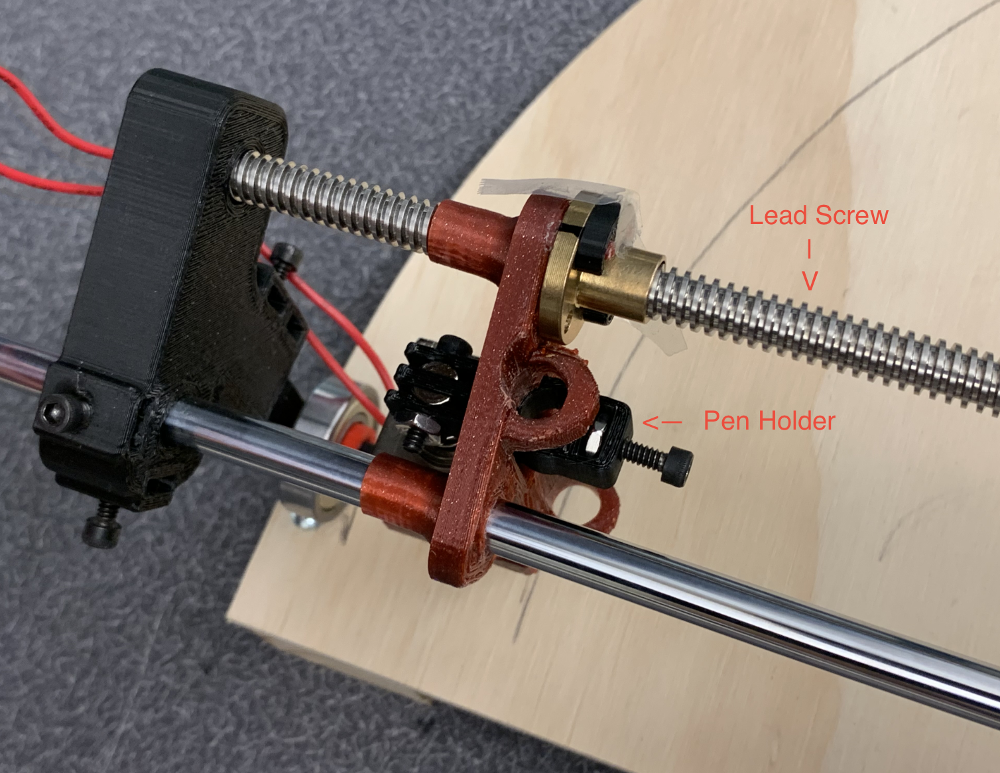
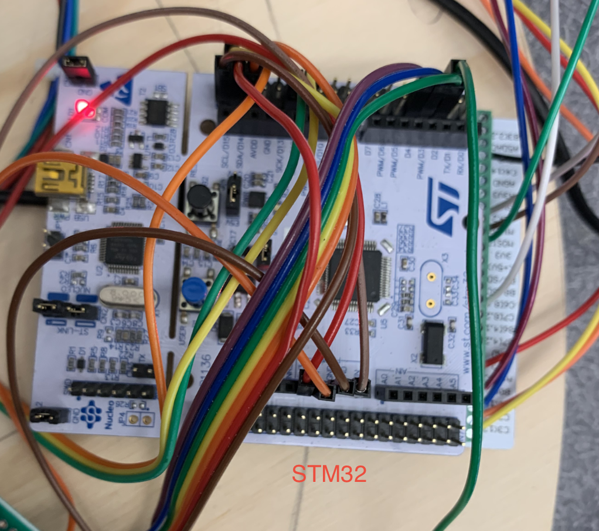
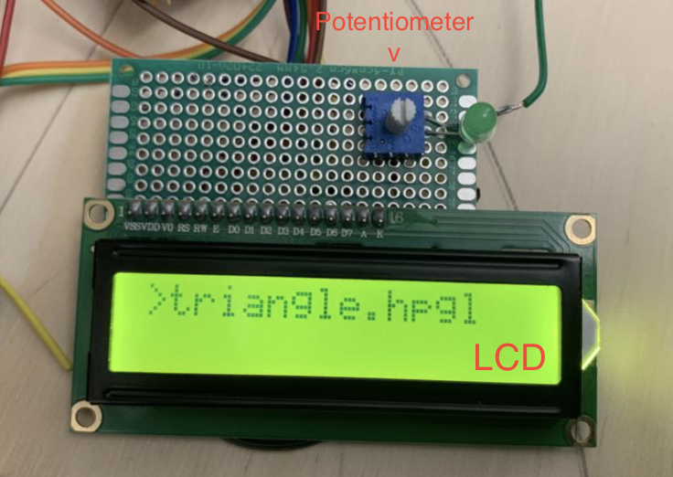
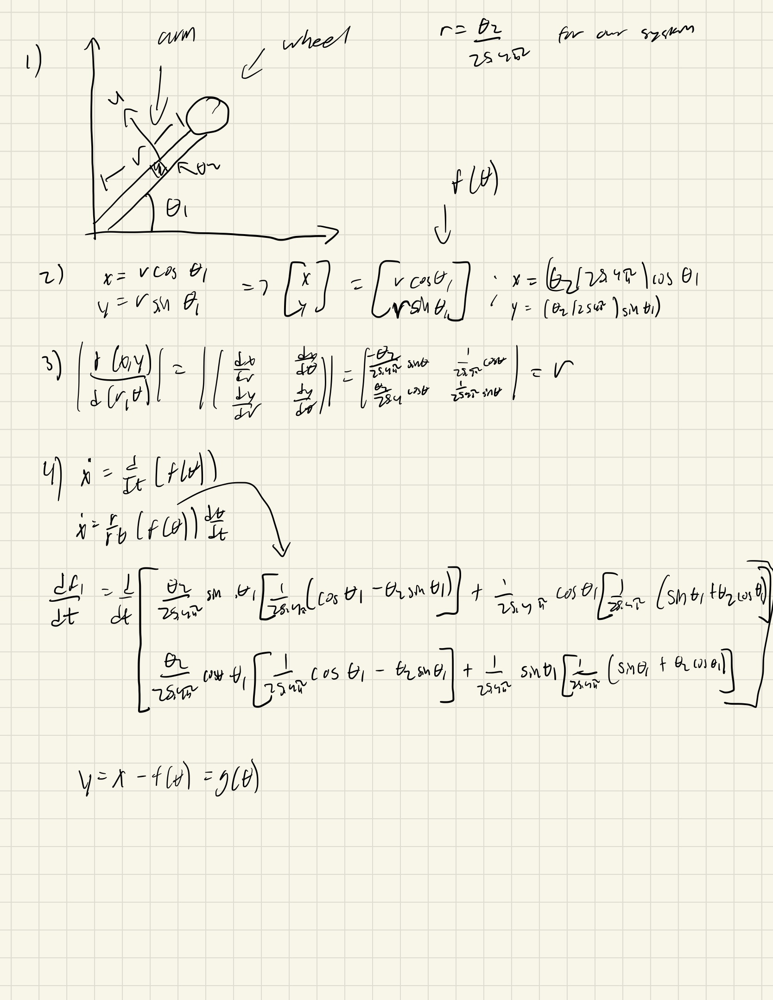

# PenPlotter
ME 405 - Term Project: 2D Pen Plotter. Created by Mike Eirinberg, Ben Bradley, and Ryan Dean.

## Project Background

In ME 405 we were tasked with creating a 2.5 degree of freedom non cartesian pen plotter with the following rules:

1. The project must be able to draw something
2. The device must move in two different degrees of freedom (non Cartesian)
3. Must use stepper motors for 2 axis'
4. Must run off of 24V benchtop power supplies drawing no more than 6A
5. Must be safe (generally no lasers, fire, or hazarderous systems)

## Proposal

We decided to create a polar-based pen plotter that utalizes 2 stepper motors, for our radius and theta axis, and a solenoid to control our pen's vertical movement. This was to be done in a system that had a mount, an arm, and a wheel. The arm would have a lead screw that controls our radius and the wheel controls our theta. An imagine of the system is shown below.

A video of our working system is shown below.

[Video demo of our system](youtube.com)

## Components

Our theta stepper motor controls our angle and our radius stepper motor controls how far out the pen is from the pivot.

Our solenoid makes our pen move up and down

Our board is the surface our program draws on. It is made out of wood.

Our lead screw moves < 2mm I think? > mm per lead. Used for slow but accurate movements.

We used the STM32 as our microcontroller. The Microcontroller has < x ram > and < x storage >. We are able to fully control our system with our microcontroller. We used micropython as our language of choice for this project.

 

The shoe of brian is neccessary as an adaptor to utalize micropython for our project. This is due to limittation present on our stm32 hardware. 

Used for tmc2208s and tmc4210s, which control our stepper motors in this project. Contains all of our power connections except for the solonoid due to hardware limitations. 

Used to show the user real time location info of where our pen is.

Used for user controlled movement. Utalizes velocity mode as in practice it is easier to draw by hand with.

## CAD

## Wiring Diagram - high level

< level 1 diagram (big boxes ins/outs) >

## Driver Design

We utalized a cooporate multiasking class driver that utalizes tasks and queues. We did this so priority tasks would not have to wait for lessor priority tasks.

## Kinematics

We used the following to determine the calculations for our system (shown below). This analysis should align with any polar-based system. 

## Newton Ralphson

Newton Ralphson is a method to find roots to a mechanical system. We used the [Kinematics](##Kinematics) to derive our equations for the radius and theta of our system. We then took the derivative of our main function and used a method of successive approximation to come up with a solution within a specified threshold. This solution is graphed and showed visually below.

## Component Walkthrough

### Microcontroller

< peripherals clocks settings etc (basically our init) >

### Stepper Motors

< level 2 diagram (detailed system) >

### Solenoid

< level 2 diagram (detailed system) >

### Power Supply and Relays

< level 2 diagram (detailed system) >

### LCD

< level 2 diagram (detailed system) >

### Joystick

< level 2 diagram (detailed system) >
